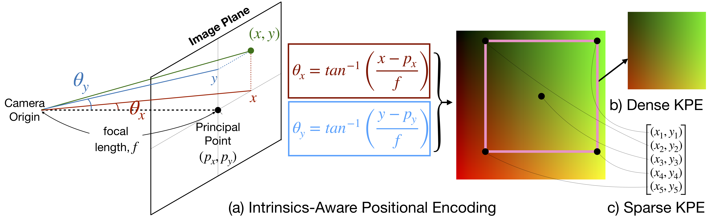

# Mitigating Perspective Distortion-induced Shape Ambiguity in Image Crops

## [Project Page](https://ap229997.github.io/projects/ambiguity/) | [Paper](https://ap229997.github.io/projects/ambiguity/assets/paper.pdf) | [Supplementary](https://ap229997.github.io/projects/ambiguity/assets/suppmat.pdf) | [Video](https://youtu.be/iPiA3rS9WQo) | [Poster](https://ap229997.github.io/projects/ambiguity/assets/poster.pdf)



This repository contains the code for the ECCV 2024 paper [Mitigating Perspective Distortion-induced Shape Ambiguity in Image Crops](https://ap229997.github.io/projects/ambiguity/assets/paper.pdf). If you find our code or paper useful, please cite
```bibtex
@inproceedings{Prakash2024Ambiguity,
    author = {Prakash, Aditya and Gupta, Arjun, and Gupta, Saurabh},
    title = {Mitigating Perspective Distortion-induced Shape Ambiguity in Image Crops},
    booktitle = {European Conference on Computer Vision (ECCV)},
    year = {2024}
}
```

## Usage

We consider several tasks in our experiments to demonstrate the effectiveness of KPE. The code for each task is present in the respective directories:
- [Parallelepipeds Case Study](./parallelepipeds)
- [3D Pose of Articulated Objects in Contact](./articulated_pose)
- [Dense Metric Depth Prediction](./metric_depth)
- [3D Object Detection](./object_detection)

## Acknowledgements

We build upon several awesome works. We thank the authors for releasing their code and data. Refer to their repo for details on licensing and citation.
- [ARCTIC](https://github.com/zc-alexfan/arctic)
- [ZoeDepth](https://github.com/isl-org/ZoeDepth)
- [MiDaS](https://github.com/isl-org/MiDaS)
- [Omni3D](https://github.com/facebookresearch/omni3d)